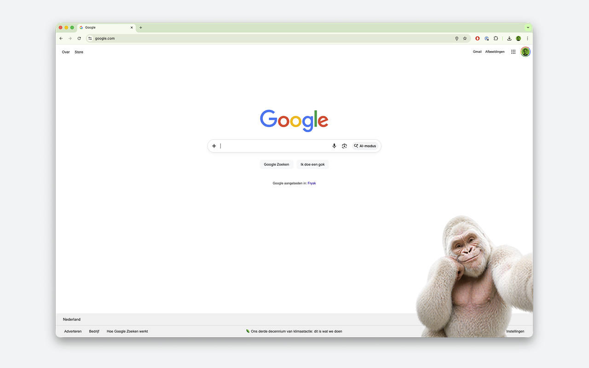

# Copito de Nieve

A quiet tribute to the only albino gorilla who ever lived.

Copito de Nieve — *"Snowflake"* — was born in the Equatorial Guinean jungle in 1964 and lived at the Barcelona Zoo from 1966 until his death in 2003. He was the only confirmed albino gorilla in recorded history. For nearly four decades he was Barcelona's most beloved resident, gently watching millions of visitors pass by his enclosure. When he died of skin cancer, the city mourned him like a family member.

This extension is a small, quiet homage to him.

## How it works

On roughly 2% of page loads, Copito appears in the bottom-right corner of the page. He stays for about two seconds, looks at you, and then disappears. That's it. No menus, no notifications, no tracking, no interruption to what you're doing. Just a brief, unexpected visit from an old friend.

Five different photographs of Copito are included, picked at random. Over time, you'll come to recognize each of his moods.

## For the impatient

If 2% feels too rare, you can summon him manually:

- Press **Alt + Shift + G** on any webpage and he will appear immediately.
- Or open DevTools, switch the Console context to **Copito de Nieve**, and call `__copito()`.

## What this extension does not do

- It does not collect any data about you.
- It does not track your browsing history.
- It does not send anything to any server.
- It does not show ads.
- It does not modify any website's content beyond briefly overlaying a small image.

The source is deliberately tiny — around 60 lines of JavaScript — so anyone curious can read it in a minute.

## Install locally

1. Open `chrome://extensions` in Chrome
2. Enable **Developer mode** (top-right)
3. Click **Load unpacked** and select this folder
4. Refresh any website — 2% chance, so keep browsing

After code changes: go to `chrome://extensions` and click the refresh icon on the extension.

## Project layout

- `manifest.json` — extension declaration
- `content.js` — the logic (chance, random pick, animation timing)
- `content.css` — positioning and animations
- `assets/` — the five gorilla PNGs
- `icon.png` — 128×128 toolbar icon

## Knobs to turn

In `content.js`:
- `CHANCE` — chance per page load (`0.02` = 2%)
- `DELAY_MS` — delay before appearance (600ms)
- `STARE_MS` — how long he stays (1800ms)
- `ENTRY_MS` — entry animation duration (400ms)

In `content.css`:
- The `cubic-bezier` on the entry transition controls the "pop" — `(0.34, 1.56, 0.64, 1)` gives a slight overshoot. For something tighter, use `ease-out`.

## More or fewer gorillas

In `content.js` there's a `GORILLAS` array with filenames. Add a new entry and drop the matching PNG into `/assets`, and it joins the random pool. No manifest changes needed — the `assets/*.png` wildcard is already there.

Transparent PNGs look best. Max ~1000px tall is plenty (the CSS scales to 50vh, max 500px).

## Why

Because the internet is loud, and Copito was quiet. Because he deserved to be remembered somewhere beyond a plaque at the Barcelona Zoo. And because every now and then, in the middle of a work day, it's nice to be reminded that the world once held something as improbable and gentle as a snow-white gorilla.

*Copito de Nieve, 1964–2003. Rest easy, old friend.*
